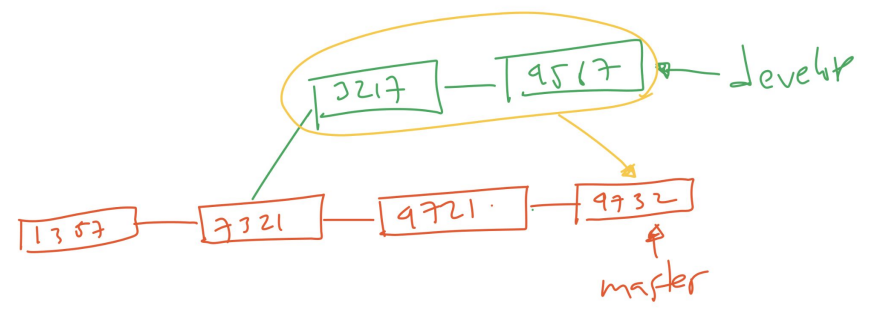

# Squash

---

## Squash

- Saat kita melakukan merge atau rebase, semua commit history akan tetap ada
- Jadi kita kita di branch tersebut melakukan commit sebanyak 10 kali, ketika kita lakukan merge atau rebase, maka 10 commit tersebut akan tetap ada
- Kadang ada kasus dimana kita ingin melakukan penggabungan commit tersebut menjadi 1 commit saja, hal ini dinamakan Squash
- Squash akan membuat 10 commit history tersebut menjadi 1 commit, dimana semua 10 perubahan tersebut akan digabungkan menjadi 1 commit saja

---

## Diagram Merge Tanpa Squash


---

## Diagram Merge Menggunakan Squash



---

## Melakukan Squash

- Squash bisa dilakukan ketika merge atau ketika rebase
- Untuk melakukan squash ketika merge, kita bisa gunakan perintah :
```
git merge --squash namabranch
```

---

## Tugas

- Di branch master, buat branch feature/merge-squash
- Di branch master, buat perubahan file version.txt
- Di branch feature/merge-squash, buat commit file 1 dan file 2
- Di branch master, merge dengan branch feature/merge-squash menggunakan squash