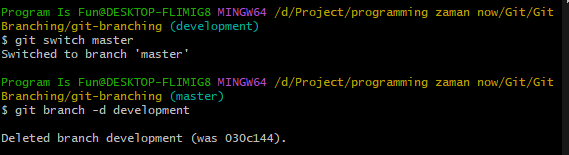

# Branch

---

## Melihat Branch Saat Ini

- Secara default, Git pasti akan membuat branch utama, biasanya master atau main
- Untuk melihat nama branch saat ini, kita bisa gunakan perintah :
```
git branch --show-current
```


---

## Membuat Branch
- Untuk membuat branch baru, caranya sangat mudah, kita bisa gunakan perintah :
```
git branch namabranchbaru
```


- Saat kita buat branch baru, secara otomatis branch baru akan dimulai dari posisi branch kita saat ini, jika misal kita membuat branch baru ketika posisi kita sedang di branch master, maka branch baru tersebut akan dibuat dari branch master

---

## Diagram Membuat Branch Baru


---

## Melihat Semua Branch

- Untuk melihat semua branch yang ada di Repository kita, kita bisa gunakan perintah :
```
git branch --list
```
- Atau lebih singkat :
```
git branch
```


---

## Pindah ke Branch Lain

- Setelah kita membuat branch baru, kita tidak secara otomatis akan pindah branch
- Untuk pindah ke branch lain, kita perlu lakukan secara manual
- Caranya kita bisa gunakan perintah :
```
git switch namabranch
git checkout namabranch
```


---

## Mengubah Nama Branch

- Jika kita melakukan kesalahan pembuatan nama branch, kita juga bisa lakukan perubahan nama branch
- Namun untuk melakukannya, kita perlu pindah terlebih dahulu ke branch yang ingin kita ubah namanya
- Setelah pindah, kita bisa gunakan perintah :
```
git branch -m namabranchbaru
```


---

## Menghapus Branch

- Jika sebuah branch sudah tidak digunakan lagi, idealnya kita perlu menghapus branch tersebut
- Untuk menghapus branch, kita perlu keluar terlebih dahulu dari branch tersebut
- Lalu gunakan perintah :
```
git branch -d namabranch
git branch --delete namabranch
```

