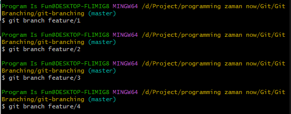
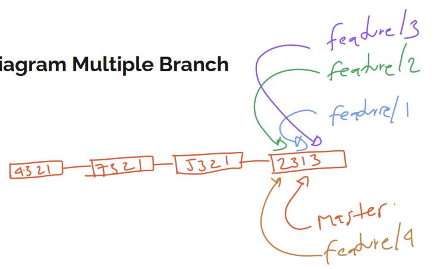
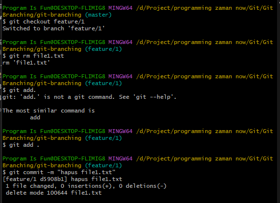
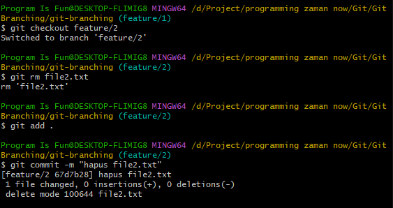
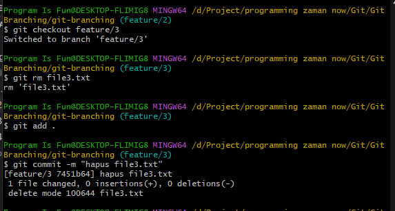
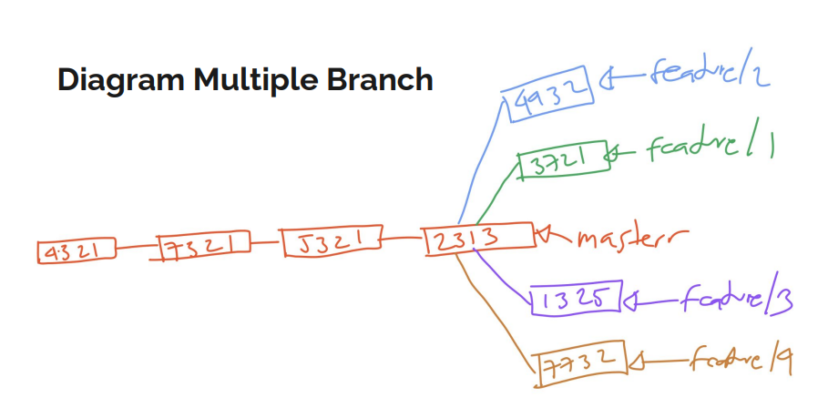

# Multiple Branch

---

## Multiple Branch

- Pada kenyataannya, saat membuat aplikasi, branch biasanya akan dibuat banyak sekali
- Git mendukung multiple branch, artinya sebanyak apapun branch yang kita buat, Git bisa menanganinya dengan baik

---

## Tugas
- Buatlah 4 branch: feature/1, feature/2, feature/3, feature/4

---

## Diagram Multiple Branch

---

## Tugas
- Lalu di tiap branch lakukan commit untuk perubahan file :
  feature/1 untuk file1.txt
  feature/2 untuk file2.txt
  feature/3 untuk file3.txt
  feature/4 untuk file4.txt

---

## Diagram Multiple Branch

