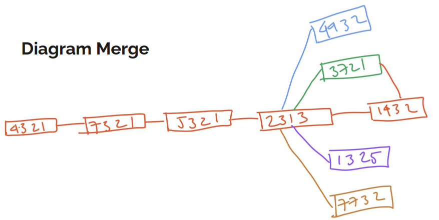

# Merge

---

## Merge

- Merge adalah proses dimana kita melakukan penggabungan dua buah branch
- Merge biasanya dilakukan setelah kita selesai membuat kode program di sebuah branch, dan ingin menggabungkan fitur tersebut ke branch lain, misal ke branch utama
- Saat kita melakukan merge, branch tidak akan dihapus, artinya kita masih tetap bisa melakukan commit di branch yang ada
- Jika kita ingin menghapus branch yang sudah di merge, kita perlu lakukan secara manual

---

## Melakukan Merge

- Untuk melakukan merge, pertama kita perlu pindah ke branch dimana kita lokasi merge akan dilakukan
- Selanjutnya gunakan perintah :
```
git merge namabranch
```
- Artinya branch dari namabranch akan di merge ke dalam branch saat ini kita berada

---

## Diagram Merge



---

## Tugas

- Merge branch feature/1, feature/2, feature/3 dan feature/4 ke branch master


---

## Diagram Merge


---

## Graph Log

- Lihat log git dalam bentuk graph menggunakan perintah :
```
git log --oneline --graph
```