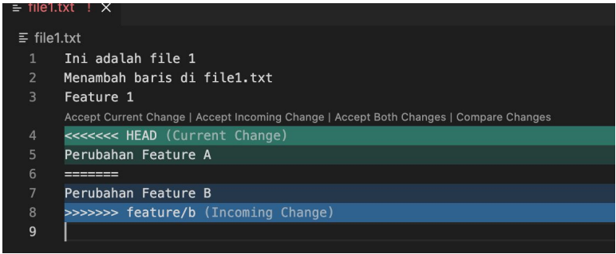
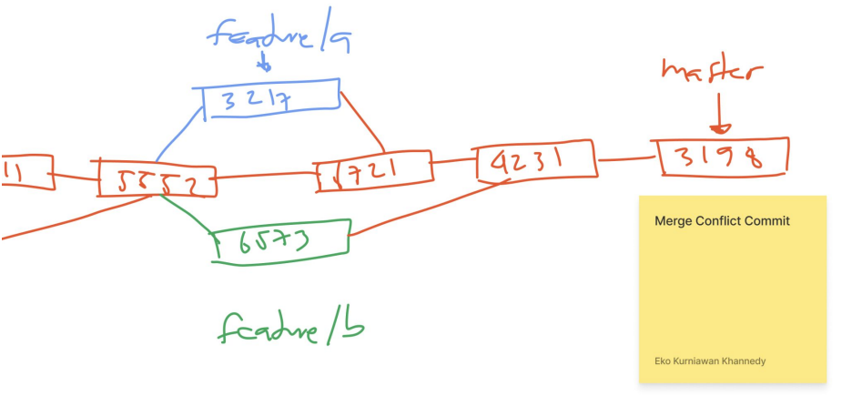

# Merge Conflict

---

## Merge Conflict

- Dalam pembuatan aplikasi, biasanya setiap programmer akan melakukan penambahkan kode program di Repository secara parallel
- Biasanya tiap programmer akan membuat branch masing-masing
- Dan tidak bisa dihindari, kadang programmer akan melakukan perubahan pada kode file yang sama di branch berbeda
- Dan biasanya ketika melakukan merge, akan terjadi yang namanya conflict
- Hal ini disebabkan, satu file diubah di branch yang berbeda, sehingga ketika di merge, kita perlu melakukan yang namanya Merge Conflict

---

## Tugas

- Buat dua branch dari branch utama
- Branch feature/a mengubah file 1 dan file 2
- Branch feature/b mengubah file 1 dan file 3
- Merge branch feature/a ke branch utama
- Merge branch feature/b ke branch utama, hal ini akan memicu conflict

---

## Membatalkan Conflict

- Jika terjadi conflict, maka kita wajib memperbaikinya terlebih dahulu
- Semua perubahan yang tidak konflik akan secara otomatis berada di Staging Index
- Sedangkan perubahan yang konflik akan secara otomatis berada di Working Directory
- Jika kita ingin membatalkan merge, kita bisa gunakan perintah :
```
git merge --abort
```
- Secara otomatis semua perubahan di branch yang ingin kita merge akan dihapus

---

## Memperbaiki Conflict

- Saat terjadi conflict, tidak ada cara otomatis memperbaikinya
- Kita perlu memperbaiki conflict secara manual
- Dan jika perbaikan conflict sudah dilakukan, maka kita perlu melakukan commit perubahan tersebut

---

## File Conflict



---

## Diagram Merge Conflict

