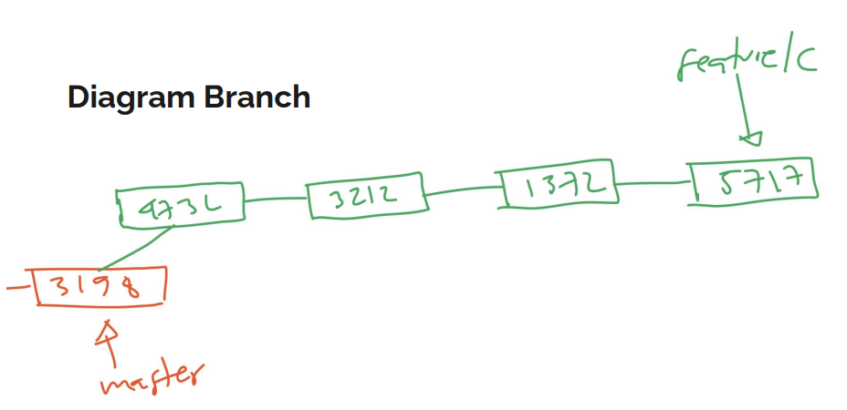
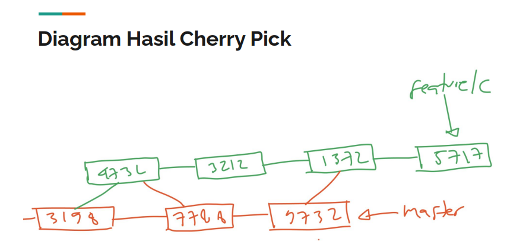

# Cherry Pick

---

## Cherry Pick

- Kadang ada kasus, ketika kita membuat kode program di sebuah branch kita ingin melakukan merge, namun tidak ingin melakukan merge semua branch nya, mungkin hanya sebagian commit saja
- Cherry Pick merupakan fitur yang digunakan untuk mengambil commit dari branch manapun dan kita merge ke dalam branch saat ini

---

## Tugas

- Buat branch feature/c
- Edit file1.txt lalu commit
- Edit file2.txt lalu commit
- Edit file3.txt lalu commit
- Edit file4.txt lalu commit

---

## Diagram Branch



---

## Melakukan Cherry Pick

- Misal sekarang kita ingin melakukan merge branch feature/c, namun kita tidak ingin merge semua perubahan
- Misal saja kita hanya ingin melakukan merge perubahan di file1.txt dan file3.txt
- Maka kita bisa melakukan cherry pick untuk commit perubahan tersebut, caranya gunakan perintah :
```
git cherry-pick commitId
```

---

## Diagram Hasil Cherry Pick

