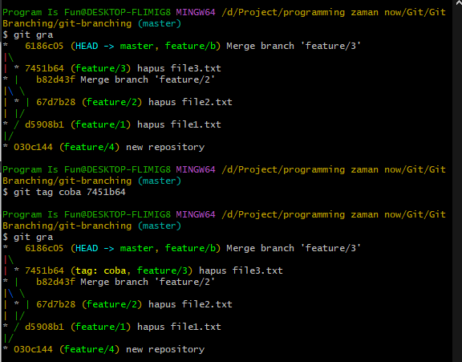

# Tag

---

## Tag

- Tag merupakan fitur, dimana kita bisa menandai sebuah commit id
- Sebelumnya kita sudah tahu dengan HEAD, yaitu reference ke commit terakhir di branch kita saat ini
- Jika kita ingin membuat sebuah reference ke sebuah commit, kita bisa menggunakan Tag
- Dalam pengembangan perangkat lunak, biasanya Tag digunakan sebagai penanda versi rilis dari aplikasi, misal Tag 1.0.0, Tag 1.0.2, dan lain-lain
- Karena Tag merupakan reference ke commit, jadi Tag bisa dilakukan di branch manapun

---

## Membuat Tag

- Tag adalah sesuatu yang unik, artinya jika kita sudah membuat tag dengan nama A, maka kita tidak bisa membuat tag dengan nama yang sama lagi
- Untuk membuat tag, kita bisa gunakan perintah :
```
git tag tagName commitId
```



---

## Tugas

- Buat file version.txt, lalu isi dengan informasi versi aplikasi
- Lakukan :
  - Ubah file dengan isi 1.0.0, lalu commit dan buat tag untuk commit tersebut
  - Ubah file dengan isi 1.0.1, lalu commit dan buat tag untuk commit tersebut
  - Ubah file dengan isi 1.0.2, lalu commit dan buat tag untuk commit tersebut

---

## Menampilkan Tag

- Untuk menampilkan semua tag yang ada di Repository, kita bisa menggunakan perintah :
```
git tag -l
git tag --list
```

---

## Checkout ke Tag

- Seperti yang sudah dijelaskan di kelas Git Dasar, kita kita melihat snapshot sebelumnya di Git
- Sekarang dengan menggunakan Tag, kita juga bisa melihat snapshot sebelumnya tanpa harus menggunakan commitId, cukup menggunakan Tag :
```
git checkout tagname
```

---

## Menghapus Tag

- Tidak ada cara untuk mengubah Tag, jadi jika kita ingin mengubah Tag, kita bisa membuat Tag baru ke commit yang sama, lalu menghapus Tag yang lama
- Untuk menghapus Tag, kita bisa gunakan perintah :
```
git tag -d namatag
git tag --delete namatag
```

---

## Tugas

- Silahkan hapus tag untuk versi rilis 1.0.1