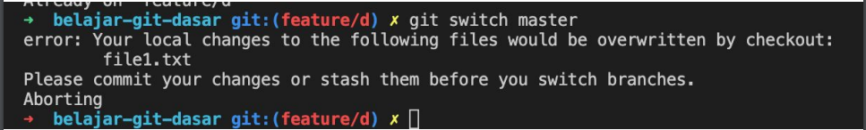

# Stash

---

## Stash

- Kadang ada keadaan, dimana kita sedang melakukan perubahan di sebuah branch, namun perubahan nya belum disimpan di Repository, misal masih di Working atau Staging Index
- Lalu kita butuh secepatnya melakukan perubahan di branch lain
- Jika perubahan tersebut belum siap kita commit, kita bisa menyimpan semua perubahan tersebut ke Stash
- Stash adalah sebuah tempat dimana kita bisa menyimpan perubahan di Working atau Staging Index secara sementara agar branch saat ini menjadi bersih kembali, sehingga kita bisa pindah ke branch lain

---

## Tugas

- Di branch utama
- Buat branch baru dengan nama feature/d
- Di branch utama, buat perubahan di file1.txt, lalu commit
- Pindah ke branch feature/d
- Lakukan perubahan file1.txt, tambahkan ke Staging Index
- Lakukan perubahan file2.txt, biarkan di Working
- Pindah ke branch utama

---

## Error Ketika Pindah Branch

- Secara default, ketika kita melakukan perpindahan branch, Git akan secara pintar membawa perubahan yang terjadi di branch saat ini ke branch tujuan pindah
- Namun jika ternyata terdapat conflict, pada kasus kita, pada file1.txt terdapat conflict, maka secara otomatis kita tidak bisa pindah ke branch tersebut



---

## Menyimpan Perubahan ke Stash

- Untuk menyimpan semua perubahan yang terjadi di Working dan Staging Index, kita bisa menggunakan Stash
- Untuk menyimpan perubahan ke Stash, kita bisa gunakan perintah :
```
git stash push -m ‘message stash’
```
- Untuk melihat semua Stash, kita bisa gunakan perintah :
```
git stash list
```
- Untuk melihat perubahan yang terjadi di Stash, kita bisa gunakan perintah
```
git stash show stashId
```

---

## Tugas

- Simpan semua perubahan ke stash
- Pindah ke branch utama

---

## Mengambil Perubahan di Stash

- Untuk mengambil perubah di stash, kita bisa gunakan perintah :
```
git stash apply stashId
```
- Untuk menghapus stash, kita bisa gunakan perintah :
```
git stash drop stashId
```
- Untuk menghapus semua stash, kita bisa gunakan perintah :
```
git stash clear
```

---

## Tugas

- Pindah ke branch feature/d
- Ambil perubahan di stash
- Lalu hapus data stash
- Commit perubahan di branch