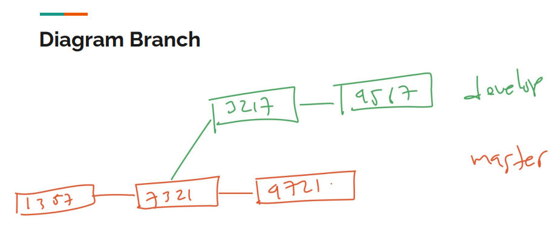
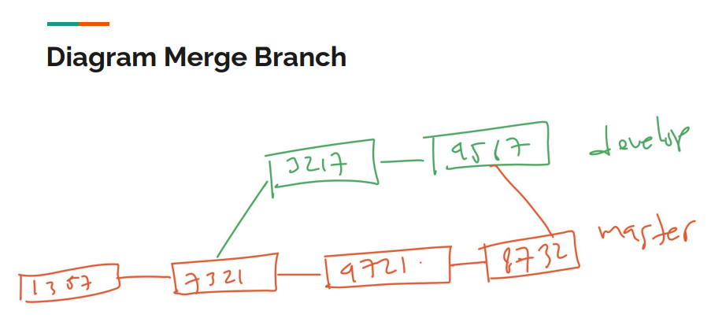
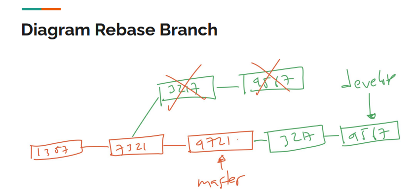
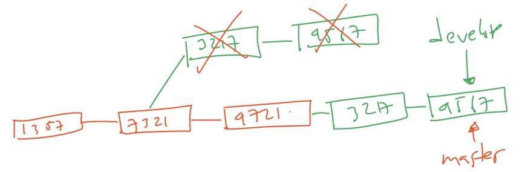

# Rebase

---

## Rebase

- Sebelumnya untuk menggabungkan dua buah branch, kita sudah belajar yang namanya merge
- Sekarang kita akan bahas tentang cara lain menggabungkan dua buah branch, yaitu rebase
- Rebase agak sedikit kompleks, jadi kita akan coba bahas secara visual

---

## Diagram Branch



---

## Diagram Merge Branch



---

## Diagram Rebase Branch



---

## Tugas

- Di branch utama, buat branch feature/rebase
- Di branch utama, ubah file1.txt lalu commit
- Pindah ke branch feature/rebase
- Di branch feature/rebase, ubah file2.txt lalu commit
- Di branch feature/rebase, ubah file3.txt lalu commit

---

## Melakukan Rebase

- Untuk melakukan rebase, kita bisa lakukan perintah :
```
git rebase namabranch
```
- Jika sekarang kita ada di branch feature/rebase, lalu menggunakan perintah :
```
git rebase master
```
- Artinya kita melakukan rebase semua commit di master ke branch develop

---

## Tugas

- Pindah ke branch feature/rebase
- Lakukan rebase dengan branch master

---

## Merge Branch

- Setelah melakukan rebase, bukan berarti branch yang di rebase sekarang posisinya ada di branch yang melakukan rebase, posisinya tetap ada di commit terakhir di branch tersebut
- Seperti yang terlihat pada gambar Diagram Rebase Branch
- Agar posisinya sama dengan branch yang melakukan rebase, kita bisa menggunakan perintah merge

---

## Diagram Setelah Merge



---

## Merge vs Rebase

- Rebase akan terlihat sangat rapih, karena timeline nya seakan terlihat hanya ada satu timeline pada Repository
- Namun, rebase sebenarnya secara otomatis menulis ulang semua commit yang kita lakukan, dalam artian commit id pasti berubah, artinya semua referensi ke commit id sebelum-sebelumnya akan rusak dan hilang
- Tidak ada mana yang lebih baik, semua tergantung kebutuhan