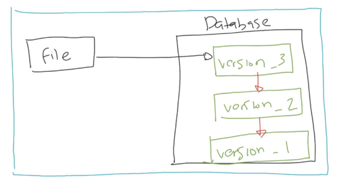

# Pengenalan Version Control

---

## Sebelum Ada Version Control System

- Saat kita mengerjakan pekerjaan, kita sering sekali melakukan revisi. Misal saja kita membuat dokumen proposal atau skripsi
- Biasanya kita akan simpan dokumen pertama dengan nama document_1, setelah mendapat revisi, kita akan simpan dengan nama document_2, jika masih ada revisi, kita akan simpan dengan nama document_3, dan seterusnya
- Kenapa kita lakukan hal tersebut? Agar kita bisa mengetahui perubahan yang terjadi antar revisi document, dan jika sewaktu-waktu kita perlu menggunakan revisi yang sebelumnya, kita bisa menggunakannya dengan mudah

---

## Version Control System

- Version Control adalah sebuah system yang merekam perubahan pada file dari waktu ke waktu, sehingga kita bisa melihat versi sebelumnya jika diinginkan
- Version Control sangat populer dikalangan programmer, karena programmer selalu membuat kode program dalam bentuk kode tulisan. Dengan version control, programmer bisa merekam semua perubahan yang terjadi, sehingga jika terjadi kesalahan, programmer bisa dengan mudah kembali ke versi sebelumnya
- Tapi tidak hanya untuk file dalam bentuk text, jika misal kita adalah seorang Graphic Designer, kita juga bisa memanfaatkan Version Control untuk merekam perubahan dari file gambar atau layout, sehingga kita tidak perlu membackup tiap perubahan secara manual

---

## Tipe Version Control

Secara garis besar, version control dibagi menjadi 3 jenis
- Local Version Control
- Centralized Version Control, dan
- Distributed Version Control

---

## Local Version Control

- Local version control merupakan version control yang berjalan hanya di local komputer
- Pendekatan ini biasa digunakan karena sederhana dan tidak butuh server, karena semua riwayat pekerjaan disimpan di local komputer
- Setiap perubahan versi yang terjadi pada file hanya disimpan di local komputer

---

## Diagram Local Version Control

---

## Centralized Version Control

- Masalah yang terjadi pada Local Version Control adalah, jika komputer rusak, maka seluruh data bisa hilang.
- Selain itu agak sulit untuk berkolaborasi dengan pengguna lain jika file hanya ada di satu komputer
- Untuk menangani masalah ini, kita bisa menggunakan Centralized Version Control
- Centralized Version Control menyimpan seluruh data revisi di Server
- Pengguna bisa mengakses data ke Server untuk melihat file
- Kekurangannya adalah, jika pengguna offline, mereka tidak bisa melihat riwayat file karena semua riwayat hanya ada di Server
- Jika Server down, maka seluruh pengguna tidak bisa melakukan perubahan dan melihat revisi file
- Contoh Centralized Version Control adalah Subversion

---

## Diagram Centralized Version Control

---

## Distributed Version Control

- Distributed Version Control adalah alternatif lain dari Centralized Version Control
- Dalam DVCs, client tidak hanya mengambil file versi terakhir, namun seluruh riwayat revisi di copy seluruhnya
- Hal ini menjadikan jika terjadi masalah dengan Server, client masih tetap bekerja, memanipulasi file, sampai melihat riwayat perubahan
- Bahkan dalam DVCs, Server bisa lebih dari satu, karena tiap server isinya sama, full backup data
- Contoh DVCs adalah Git, Mercurial dan lain-lain

---

## Diagram Distributed Version Control

