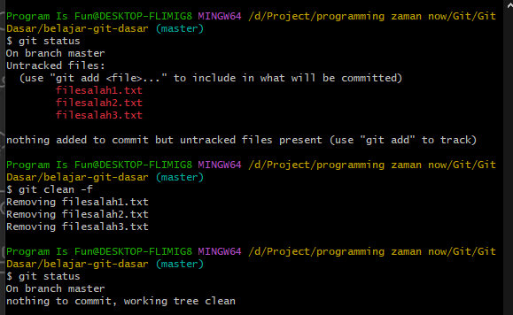
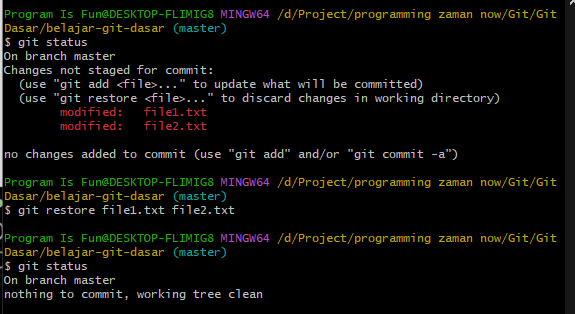
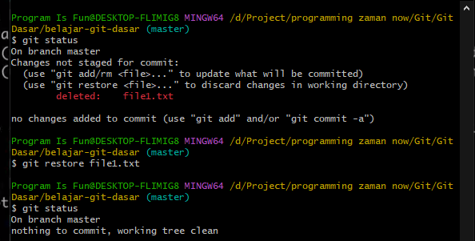
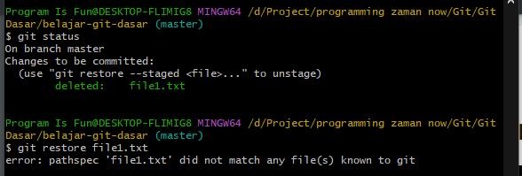
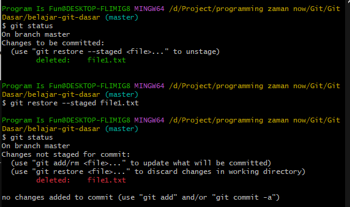

# Membatalkan Perubahan

---

## Membatalkan Penambahan File

- Jika kita menambah file di Working Directory, lalu misal kita ingin membatalkan perubahannya
- Caranya cukup sederhana, kita hanya perlu menghapus file tersebut, atau bisa menggunakan perintah :

```
git clean -f
```



---

## Membatalkan Perubahan File

● Jika kita ingin membatalkan perubahan file yang telah kita lakukan, kita bisa menggunakan perintah :
```
git restore namafile
```

---

## Kode : Git Restore



---

## Membatalkan Penghapusan File

● Penghapusan file sebenarnya sama dengan perubahan file, jadi jika kita ingin membatalkan penghapusan file, kita bisa gunakan perintah yang sama dengan membatalkan perubahan file :
```
git restore namafile
```

---

## Kode : Git Restore



---

## Membatalkan dari Staging Index

● Perintah git restore hanya bisa dilakukan untuk membatalkan perubahan yang terjadi di Working Directory
● Artinya jika perubahan terlanjur kita masukkan ke Staging Index, maka untuk membatalkannya tidak bisa kita lakukan secara langsung dari Staging Index
● Kita perlu mengembalikan posisi dari Staging Index ke Working Directory terlebih dahulu, caranya kita bisa gunakan perintah :
```
git restore --staged namafile
```
---

## Kode : Git Restore di Staging Index



---

## Kode : Git Restore ke Working Directory



---

## Membatalkan Yang Sudah di Commit

- Bagaimana jika perubahan yang kita lakukan terlanjur di commit?
- Tidak ada cara yang bisa kita lakukan jika perubahan sudah terlanjur di commit
- Yang bisa kita lakukan adalah dengan dua cara, Rollback Commit atau Revert Commit
- Kedua cara tersebut akan kita bahas di materi sendiri-sendiri