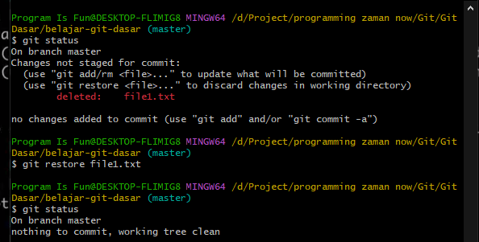

# Commit Log

---

## Commit Log

- Git adalah distributed version control, artinya walaupun kita Repository di local komputer kita, semua riwayat perubahan disimpan di komputer kita
- Kekurangannya menjadi makin lama Repository akan semakin besar ukurannya, namun keuntungannya, kita bisa melihat semua riwayat commit, atau disebut Commit Log
- Untuk melihat Commit Log, kita bisa gunakan perintah :
```
git log
```

---

## Kode : Git Log


---

## Log Sederhana

● Kadang kita hanya ingin melihat commit log message nya saja atau istilahnya adalah versi sederhananya saja
● Untuk melakukan itu, kita bisa gunakan perintah :
```
git log --oneline
```
---

## Kode : Git Log Oneline


---

## Graph

- Saat nanti kita sudah belajar tentang Git Branching, kadang kita ingin melihat commit log dengan hubungannya dengan commit log sebelumnya
- Hal ini bisa kita lakukan menggunakan perintah :
```
git log --oneline --graph
```

---

## Kode : Git Log Graph



---

## Kode : Contoh Git Graph Kompleks


---

## Melihat Detail Commit
- Kadang kita ingin melihat detail perubahan yang terjadi pada sebuah commit
- Untuk melakukan itu, kita bisa gunakan perintah :
```
git show hash
```

---

## Kode : Git Show


Atau bisa juga melihat perubahan terakhir : 

