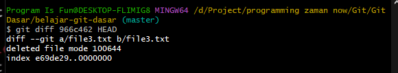
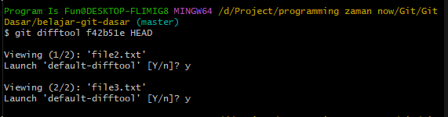
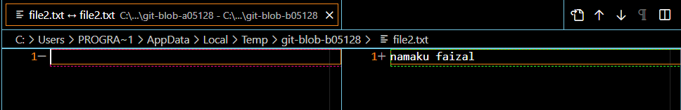

# Compare Commit

---

## Compare Commit

- Git memiliki fitur untuk membandingkan antara commit dengan commit lainnya
- Namun jangan sampai salah pengertian, membandingkan disini adalah membandingkan snapshot hasil commit, bukan perubahan yang terjadi antara commit
- Misal pada commit sebelumnya kita pernah menambah file3.txt, namun jika kita bandingkan antara commit pertama dan terakhir (HEAD), hasilnya hanyalah perbandingan antara file1 dan file2, tidak ada file3
- Hal ini dikarenakan membandingkan commit bukanlah membandingkan perubahan yang pernah terjadi, melainkan membandingkan hasil di commit
- Untuk membandingkan commit, kita bisa gunakan perintah :
```
git diff hash1 hash2
```

---

## Kode : Git Diff



---

## Difftool

- Sebelumnya kita sudah melakukan pengaturan menggunakan Visual Studio Code untuk melihat diff
- Jika kita ingin menggunakan visual studio code untuk melihat perbedaan antar commit, kita bisa gunakan perintah :
```
git difftool hash1 hash2
```

---

## Difftool Visual Studio Code



