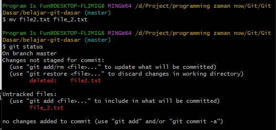
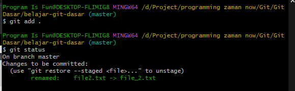

# Rename File

---

## Rename File

- Hal yang paling menarik di Git adalah, Git bisa mendeteksi rename file
- Secara sederhana sebenarnya rename file merupakan operasi gabungan antara hapus file, lalu menambah file baru dengan isi yang sama
- Namun Git bisa otomatis mendeteksi jika terjadi perubahan nama file, karena isi file sebagian besar masih sama

---

## Kode : Git Status

---

## Kode : Git Status di Staging Index

