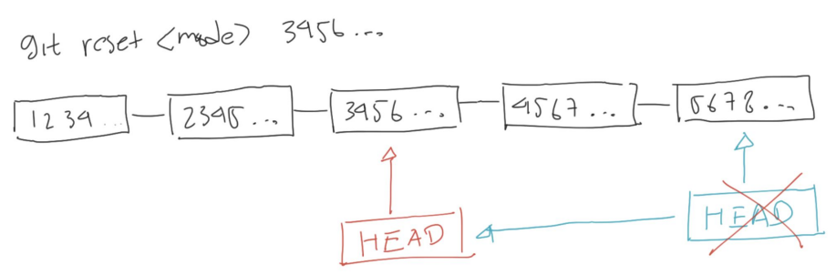
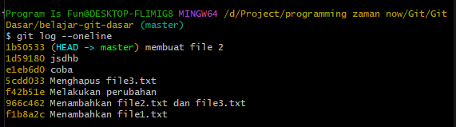
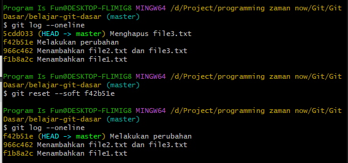
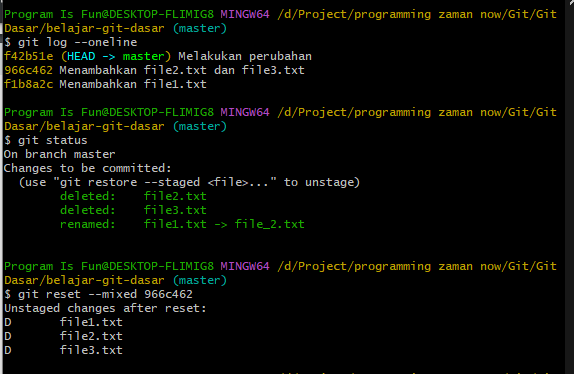
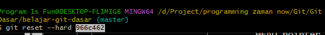

# Reset Commit

---

## Reset Commit

- Sebelumnya kita sudah tahu membatalkan perubahan, namun bagaimana jika ternyata perubahan sudah terlanjur kita commit ke Repository?
- Untuk hal seperti itu, kita bisa melakukan reset commit
- Reset commit merupakan mekanisme dimana kita menggeser HEAD pointer ke posisi commit yang kita mau, artinya commit selanjutnya akan dilakukan pada posisi HEAD baru
- Untuk melakukan reset commit, kita bisa gunakan perintah :
```
git reset <mode> hash
```
- Ada beberapa mode pengaturan melakukan reset commit

---

## Diagram Git Reset



---

## Mode Git Reset
- --soft, memindahkan HEAD pointer, namun tidak melakukan perubahan apapun di Staging Index dan Working Directory
- --mixed (default), memindahkan HEAD pointer, mengubah Staging Index menjadi sama seperti dengan Repository, namun tidak mengubah apapun di Working Directory
- --hard, memindahkan HEAD pointer, dan mengubah Staging Index dan Working Directory sehingga sama dengan Repository

---

## Kode : Git Log



---

## Kode : Git Reset Soft



---

## Rewrite Riwayat Commit
- Jika kita melakukan reset, namun kita belum membuat commit baru
- Kita masih bisa kembali maju lagi ke commit yang paling baru
- Namun jika kita membuat commit baru, secara otomatis commit lama akan ditimpa oleh commit baru

---

## Kode : Git Reset Mixed



---

## Kode : Git Reset Hard

