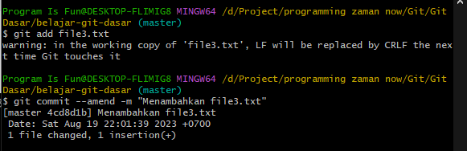

# Amend Commit

---

## Amend Commit

- Kadang saat sudah melakukan commit, mungkin ada beberapa hal yang terlupakan
- Biasanya kita akan lakukan reset soft ke commit sebelumnya, lalu tambahkan perubahan yang terlupakan, lalu kita lakukan commit ulang
- Hal tersebut bisa dilakukan tanpa manual melakukan reset, caranya bisa menggunakan perintah :
```
git commit --amend
```
- Perlu diingat, amend akan mengubah hash commit karena data perubahan yang dicommit bertambah

---

## Tugas
- Tambah file3.txt
- Commit file3.txt ke Repository
- Ubah file3.txt
- Commit dengan amend ke Repository :
```js
git commit --amend
```

---

## Kode : Git Commit Amend

