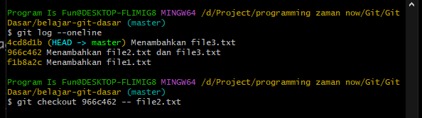

# Versi Sebelumnya

---

## Versi Sebelumnya

- Kadang kita sering mengalami masalah dengan file yang sudah kita commit ke Repository
- Git memiliki fitur dimana kita bisa melihat versi file pada commit sebelumnya
- Saat kita ambil versi file sebelumnya, file pada commit tersebut akan berada di Staging Index
- Untuk melakukannya, kita bisa gunakan perintah :
```
git checkout hash -- namafile
```

---

## Kode : Git Status

Misal kita ingin melihat file1.txt sebelum terjadi perubahan di commit 1b5f564, maka kita bisa gunakan perintah : 
```
git checkout 2118ac3 -- file1.txt
```

---

## Kode : Git Checkout

