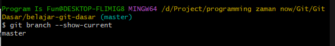
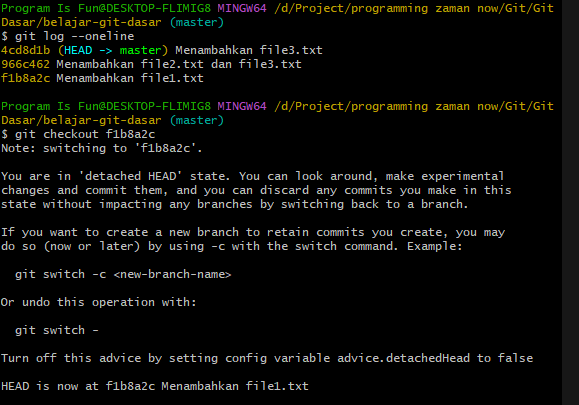
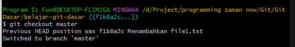

# Snapshot Sebelumnya

---

## Snapshot Sebelumnya

- Git juga memiliki fitur seperti mesin waktu, dimana kita bisa kembali pada snapshot sebelumnya
- Kita bisa tentukan kemana tujuan snapshot kita hanya dengan menggunakan hash commit
- Cara jika kita ingin menuju ke snapshot tertentu, cukup gunakan perintah :
```
git checkout hash
```
- Jika ingin kembali ke paling awal, kita bisa gunakan perintah :
```
git checkout namabranch
```

---

## Git Branch
- Materi branching akan dibahas pada course terpisah, namun secara default saat kita membuat Git Repository, maka secara otomatis Git akan membuat branch
- Untuk melihat nama branch saat ini, kita bisa gunakan perintah :
```
git branch --show-current
```



---

## Kode : Git Checkout



---

## Kode : Kembali Ke Commit Terakhir

