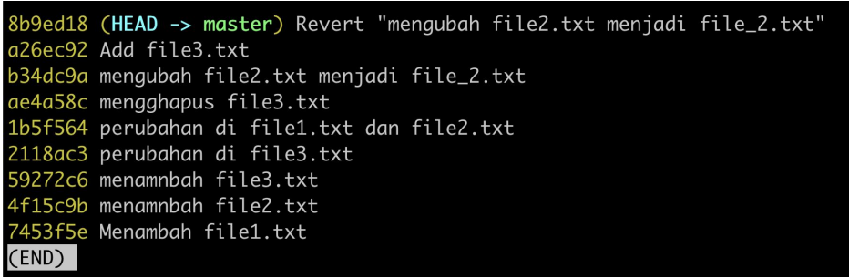

# Revert Commit

---

## Revert Commit

- Git memiliki fitur revert commit, yaitu fitur untuk membatalkan commit yang sudah kita lakukan dengan cara membuat commit baru yang membatalkan commit sebelumnya
- Misal kita sudah melakukan commit data perubahan dari text Eko menjadi Eka, jika kita revert, secara otomatis akan membuat commit baru dengan melakukan perubahan dari Eka ke Eko
- Untuk melakukan revert commit, kita bisa gunakan perintah :
```
git revert hash
```

---

## Kode : Git Status

- Misal kita akan revert commit melakukan rename dari file2.txt menjadi file_2.txt

---

## Kode : Git Revert


---

## Kode : Git Log Setelah Revert

