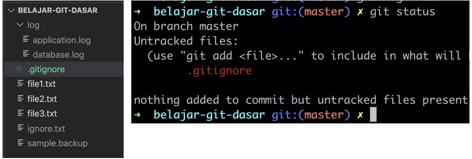

# Ignore

---

## Ignore

- Kadang saat membuat aplikasi, tidak semua file ingin kita track di Git, contoh seperti file log, hasil kompilasi, kadang itu tidak butuh di track di Git
- Git memiliki fitur ignore, dimana kita bisa meminta Git secara otomatis tidak men-track file di Git
- Caranya kita bisa tambahkan file .gitignore di Repository
- Lalu kita bisa tambahkan tiap baris di file .gitignore berisikan file atau folder yang tidak kita ingin track

---

## Kode : File .gitignore

---

## Kode : Git Status

