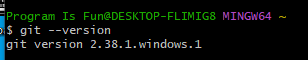
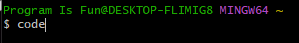
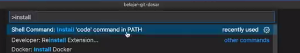

# Pengenalan Git

---

## Sejarah Git

- Git muncul dengan latar belakang OpenSource project Linux Kernel
- tahun 1991-2002, Linux Kernel di develop hanya dengan memanfaatkan patch dan archived files
- Tahun 2002, Linux Kernel mulai menggunakan DVCs bernama BitKeeper
- Di tahun 2005, hubungan antara perusahaan pemilik BitKeeper dengan komunitas Linux Kernel kurang baik, sehingga pembuat Linux, Linus Torvalds mulai membuat DVCs sendiri
- Git pertama kali dikenalkan tahun 2005, semakin kesini Git semakin populer dan sekarang menjadi DVCs yang paling populer di dunia
- Git sangat cepat, ringan dan baik dalam me-manage project dengan ukuran besar

---

## Pengenalan Git

- Jadi, Git adalah salah satu DVCs yang ada
- Git tidak membutuhkan server untuk melakukan perubahan atau melihat riwayat revisi, hal ini dikarenakan dalam Git, semua riwayat project akan selalu di duplikasi, baik itu di server ataupun di local computer
- Artinya sebenarnya Git juga bisa digunakan sebagai Local Version Control
- Setiap perubahan yang terjadi di Git akan selalu dibuat signature (tanda) nya menggunakan algoritma hashing SHA-1. Hal ini menjadikan perubahan sekecil apapun pasti bisa dideteksi oleh git.
- Semua hal yang terjadi di git secara otomatis akan dicatat, hal ini menjadikan perubahan apapun di Git, pasti selalu bisa dikembalikan ke versi sebelumnya

---

## Menginstall Git

- Git adalah aplikasi OpenSource dan Gratis, kita bisa download aplikasi Git dengan bebas
- Git tersedia untuk berbagai sistem operasi, seperti Windows, Mac dan Linux
- Kita bisa download Git di : https://git-scm.com/downloads

---

## Memastikan Git Berjalan

- Git merupakan aplikasi berbasis terminal / command line, oleh karena itu, untuk menggunakan Git, kita perlu membuat terminal / command line
- Untuk mengecek versi Git yang terinstall di local computer kita, kita bisa gunakan perintah :
```
git --version
```



---

## Tool Pembantu

- Visual Studio Code : https://code.visualstudio.com/
- Install di PATH
> Jika sudah ada:

> jika belum : 
