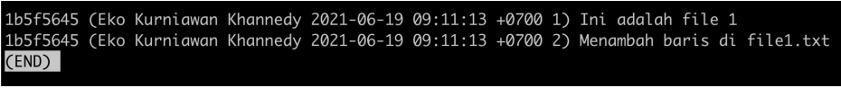

# Blame

---

## Blame

- Saat membuat kode program kadang kita ingin tahu, siapa yang menambahkan baris kode program tersebut, dan apa saja yang ditambahkan
- Git memiliki fitur yang bernama blame, ini digunakan untuk mencari tahu, siapa yang menambah perubahan pada file dan juga untuk mengetahui commit nya
- Caranya kita bisa gunakan perintah :
```
git blame namafile
```

---

## Kode : Git Blame

