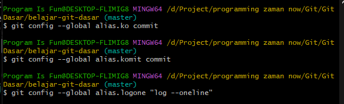
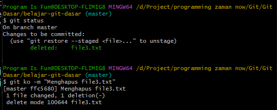
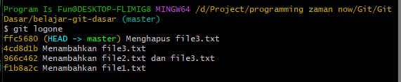

# Alias

---

## Alias

- Git memiliki fitur yang bernama alias
- Dengan alias, kita bisa menambah nama perintah lain untuk perintah yang sudah ada di git
- Misal kita bisa menambah perintah co, komit untuk nama lain dari commit misalnya
- Atau misal menambah alias logline untuk nama lain dari log --oneline

---

## Kode : Menambah Alias

---

## Kode : Menggunakan Alias

