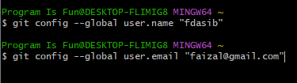
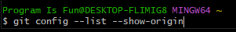

# Configuration

---

## Configuration

- Setelah selesai menginstall git, hal yang pertama kali kita lakukan adalah melakukan konfigurasi
- Yang paling utama yang perlu kita konfigurasi diawal adalah user name dan user email 

---

## Menggunakan Visual Studio Code

- Agar mempermudah, kita akan menjadikan Visual Studio Code sebagai default editor untuk Git dan default diff tool

---

## Melihat Seluruh Configuration

untuk exit  : **tekan q**