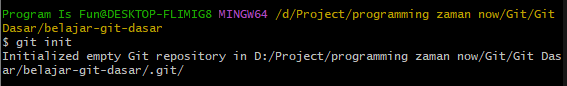
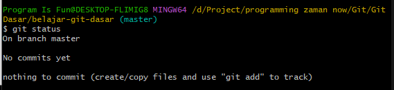

# Repository

---

## Repository

- Repository merupakan sebutan project di Git
- Kita bisa membuat folder kosong atau folder yang sudah berisi file, lalu membuatnya sebagai Git Repository
- Atau kita bisa melakukan clone Git Repository yang sudah ada dari Server Git

---

## Membuat Repository

- Untuk membuat repository, kita hanya perlu menggunakan perintah :
```
git init
```
- Dan dilakukan dari dalam folder yang akan kita jadikan sebagai Git Repository
- Setelah membuat Git Repository, kita bisa lihat ada folder baru dengan nama .git
- .git merupakan folder yang berisikan database Git, jangan sampai kita mengubah data yang terdapat pada folder .git

---

## Kode : Git Init

```
git init
```



---

## Kode : Git Status

```
git status
```



> commit : riwayat