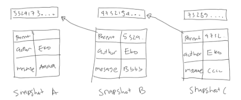
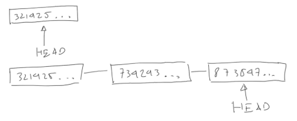

# Hash

---

## Snapshot

- Pada materi sebelumnya kita selalu menyebutkan versi pada perubahan file
- Sebenarnya perubahan yang dilakukan bisa jadi dilakukan secara bersamaan untuk beberapa file, hal ini berarti sebenarnya tidak ada yang namanya versi file
- Semua perubahan yang terjadi akan direkam, dan kita sebut namanya adalah snapshot
- Snapshot berisikan semua perubahan yang terjadi di semua file yang kita commit
- Setiap snapshot akan menghasilkan hash

---

## Hash

- Setiap snapshot yang kita lakukan, semua akan menghasilkan hash sebagai identitas snapshot nya
- Hash merupakan checksum untuk menghitung perubahan yang terjadi
- Git menggunakan algoritma SHA-1 untuk menghitung hash
- Hash dibutuhkan untuk menjaga data integrity, sehingga tiap snapshot yang sudah kita lakukan tidak bisa diubah, hal ini karena akan secara otomatis merusak hash yang sudah dibuat
- Contoh hash Git : 30534aeabde65981732c6c469b7583483d379b00

---

## Diagram Snapshot

---

## Perhitungan Hash

- Perhitungan hash dilakukan tidak hanya dari perubahan file
- Namun juga dari parent, author dan message
- Artinya perubahan yang terjadi pada snapshot sebelumnya, maka akan menimbulkan efek berantai, karena semua hash selanjutnya akan berubah
- Oleh karena itu, hal tersebut tidak bisa dilakukan di Git

---

## HEAD

- HEAD merupakan pointer menuju hash yang paling akhir
- Karena kadang sangat menyulitkan jika harus menuliskan hash value, jika kita akan menuju ke hash paling baru, kita bisa gunakan kata HEAD

---

## Diagram HEAD

