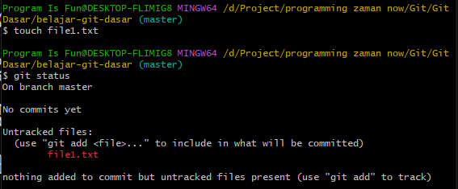
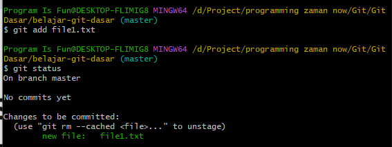
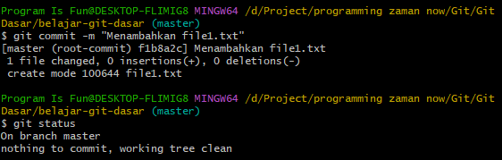
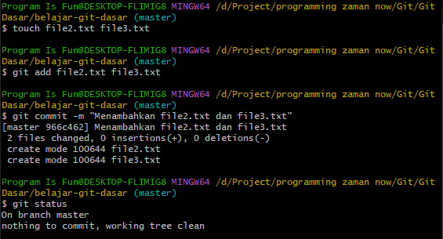

# Menambah File

---

## Menambah File

- Untuk menambah file baru ke Repository, kita cukup tambahkan file nya saja
- Secara otomatis file yang kita tambahkan awalnya akan berada di working directory
- Secara default saat menambah file baru, file tersebut tidak akan di track perubahannya
- Agar perubahan di track, kita harus pindahkan dari working directory ke staging index
---

## Kode : Untracked Files

> membuat file baru
```
touch file1.txt
```

> mengecek status
```
git status
```



---

## Kode : Memindahkan ke Staging Index

> memidahkan file baru
```
git add file1.txt
git status
```



---

## Kode : Commit ke Repository

```
git commit -m "Menambahkan file1.txt"
git status
```



---

## Tugas

- Tambah file2.txt, lalu commit ke Repository
- Tambah file3.txt, lalu commit ke Repository

```
touch file2.txt file3.txt
add file2.txt file3.txt
git commit -m "Menambahkan file2.txt dan file3.txt"
git status
```

