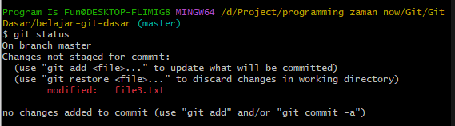
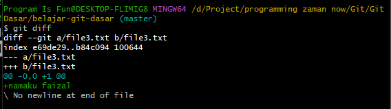

# Mengubah File

---

## Mengubah File

- Untuk melakukan perubahan file, kita cukup lakukan perubahan file terhadap file yang sudah ada di Repository
- Secara otomatis git bisa mendeteksi perubahan
- Sama seperti dengan menambah file, jika perubahan ingin kita simpan secara permanen, kita bisa pindahkan ke staging index, lalu commit ke Repository

---

## Kode : Git Status



---

## Melihat Perubahan File

- Ketika kita melakukan perubahan, Git secara otomatis mendeteksi bahwa file tersebut berubah
- Jika kita ingin melihat perubahan yang terjadi, kita juga bisa menggunakan Git untuk melihat perubahan nya dengan perintah :
```
git diff
```

---

## Kode : Melihat Perubahan File



---

## Tugas

- Commit perubahan file3.txt ke Repository
- Ubah file1.txt dan file2.txt secara bersamaan, lalu commit semuanya ke Repository