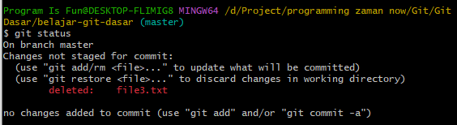
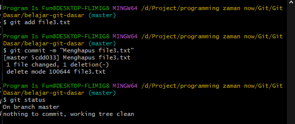

# Menghapus File

---

## Menghapus File

- Untuk menghapus file di Repository, kita cukup lakukan delete file nya di folder nya
- Secara otomatis Git akan mendeteksi file yang hilang
- Sama seperti menambah dan menghapus, jika ingin simpan secara permanen di Repository, kita harus menambahkan operasi tersebut ke Staging Index, lalu commit ke Repository

---

## Kode : Git Status

---

## Kode : Git Commit

