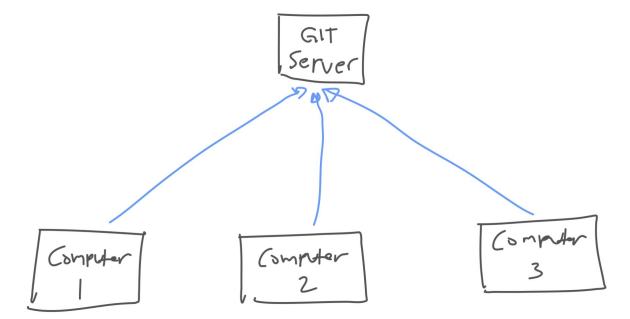
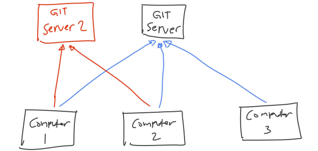

# Pengenalan Git Remote

---

## Git Remote

- Sebelumnya kita sudah belajar semua fitur yang terdapat di Git
- Namun semua fitur yang kita bahas, masih kita lakukan di local komputer kita masing-masing
- Saat nanti bekerja dengan tim, atau berkolaborasi, kita tidak hanya akan menyimpan git repository pada satu komputer saja
- Tiap anggota tim, kemungkinan akan meng-copy git repository yang kita buat, dan juga melakukan kontribusi ke git repository nya
- Git mendukung centralized server, dimana kita bisa menyimpan perubahan git repository di komputer ke Git server
- Karena Git merupakan distributed version control, walaupun kita gunakan Git Server, tapi kita tidak wajib terkoneksi ketika ingin mengelola git repository
- Hanya ketika kita ingin mengirim perubahan atau mengambil perubahan, baru kita butuh terkoneksi ke Git Server

---

## Diagram Git Remote

---

## Multiple Git Server

- Karena Git merupakan distributed system, jadi kita tidak hanya bisa menggunakan satu Git Server
- Jika kita mau, kita juga bisa menggunakan beberapa Git Server sekaligus ketika membuat git repository
- Nanti kita bisa memilih, mau mengirim perubahan atau mengambil perubahan ke Git Server yang mana

---

## Diagram Multiple Git Server

