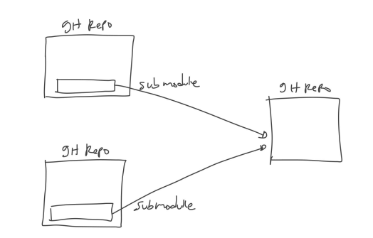

# Submodule

---

## Submodule

- Saat kita membuat project aplikasi, kadang kita ingin membuat library yang berisi kode program yang ingin digunakan di beberapa aplikasi
- Pada kasus seperti ini, fitur Git Submodule sangat bermanfaat
- Git Submodule memungkinkan kita menambahkan git repository ke git repository yang lain, atau dinamakan submodule
- Dengan menggunakan submodule, kita bisa melakukan management git repository terpisah, namun kita bisa mengakses git repository lain

---

## Diagram Submodule



---

## Menambah Submodule

- Untuk menambah submodule ke dalam git repository, kita bisa gunakan perintah :
```
git submodule add urlgitrepo namafolder
```
- Saat kita menambah submodule, secara otomatis semua git repository submodule tersebut akan di clone ke dalam folder yang kita tentukan
- Bagaimana git mendeteksi bahwa folder itu adalah submodule?
- Git akan mendeteksinya dari file .gitmodules

---

## Submodule Repository

- Saat kita masuk ke folder submodule, sebenarnya akan seperti berada di project git repository submodule tersebut
- Kita bisa melakukan management git repository di submodule tersebut, seperti melakukan commit, mengelola branch, dan lain-lain
- Namun tidak disarankan untuk melakukan perubahan di submodule, lakukanlah perubahan langsung di git repository nya, anggap submodule hanya digunakan untuk menduplikasi perubahan yang terjadi di git repository sumber asli nya

---

## Update Submodule

- Jika terjadi perubahan di repository submodule, kita bisa mendapat update perubahannya dengan menggunakan perintah :
```
git submodule update --remote namafolder
```
- Atau jika ingin semua submodule di update, kita bisa gunakan perintah :
```
git submodule update --remote
```
- Atau jika ingin melakukan update manual, kita bisa masuk ke dalam folder submodule, lalu melakukan pull ke git remote submodule tersebut

---

## Clone Submodule

- Saat kita melakukan clone sebuah git repository yang terdapat submodule nya, tidak secara default repository submodule akan di clone juga
- Setelah kita melakukan clone, kita perlu melakukan perintah init untuk mengaktifkan module nya dengan perintah :
```
git submodule init
```
- Perintah ini akan membaca dari file .gitmodule lalu membuat submodule sesuai dengan file tersebut
- Selanjutnya untuk download submodule git repository nya, kita bisa gunakan perintah submodule update

---

## Mengubah Branch Submodule

- Untuk mengubah branch di submodule, sebenarnya kita bisa lakukan secara manual menggunakan perintah git branch
- Namun hal ini tidak akan membuat konsisten, karena bisa jadi tiap orang bisa berbeda-beda branch submodule nya
- Agar sama, kita bisa gunakan perintah submodule set-branch untuk mengubah branch submodule, sehingga secara otomatis semua git repo akan menggunakan branch yang sudah ditentukan
- Caranya kita bisa gunakan perintah :
```
git submodule set-branch --branch namabranch namafolder
```

---

## Menghapus Submodule

- Untuk menghapus submodule, kita bisa hapus folder submodule nya, lalu ubah file .gitmodules nya