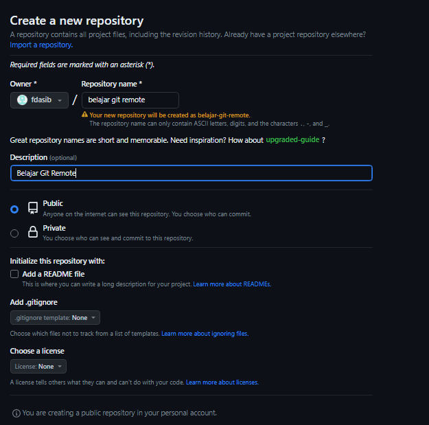

# Git Server Repository

---

## Git Server Repository

- Tiap Git Server biasanya memiliki fitur untuk membuat Git Repository
- Tidak wajib kita harus membuat Git Repository di local dulu jika ingin membuat Git Repository di

---

## Git Server

- Sekarang silahkan buat Git Repository di Github dengan nama belajar-git-remote
- https://github.com/new

