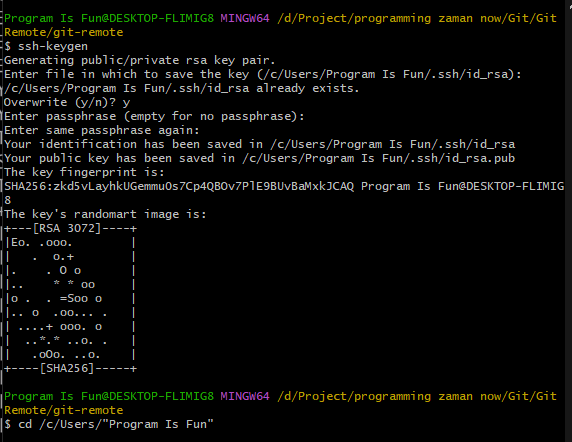

# SSH

---

## SSH

- SSH adalah singkatan dari Secure Shell
- SSH merupakan protokol jaringan untuk komunikasi jaringan yang aman dan terenkripsi
- Pengguna sistem operasi Linux atau Mac biasanya sudah sangat familiar dengan SSH
- SSH merupakan aplikasi berbasis terminal
- Di Linux dan Mac, SSH sudah terinstall secara otomatis, sedangkan di Windows, ketika kita menginstall Git, secara otomatis Git akan menginstall SSH juga

---

## Git SSH

- Git sendiri memiliki beberapa mekanisme untuk berkomunikasi dengan Git Server, seperti http dan SSH
- Pada kelas ini, kita akan menggunakan SSH untuk berkomunikasi dengan Git Server
- Hal ini karena SSH merupakan protokol yang direkomendasikan ketika berkomunikasi dengan Git Server

---

## SSH Key

- Hal pertama yang perlu kita lakukan ketika menggunakan SSH adalah, membuat SSH Key
- SSH Key merupakan kunci yang digunakan untuk autentikasi ke SSH Server
- Untuk membuat SSH Key, kita bisa gunakan perintah ssh-keygen di terminal
- Setelah selesai, maka secara otomatis akan terdapat 2 key di local kita, yaitu private key dan public key
- Kita bisa melihatnya di dalam folder .ssh di Home directory kita
- File id_rsa adalah private key, dan id_rsa.pub adalah public key




---

## Menambahkan SSH Public Key ke Github

- Setelah kita membuat SSH Key, selanjutnya kita perlu meregistrasikan SSH public key ke Github
- Hal ini dilakukan, agar ketika kita nanti terkoneksi ke Git Server di Github, kita tidak perlu melakukan autentikasi lagi
- https://github.com/settings/keys


---

## Test SSH ke Github

- Selanjutnya untuk memastikan apakah kita sudah bisa terkoneksi ke Github menggunakan SSH, kita bisa gunakan perintah :
```
ssh -T git@github.com
```

