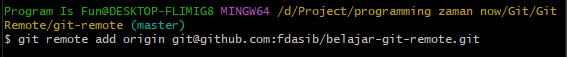

# Remote Repository

---

## Remote Repository

- Ketika kita membuat Git Project, secara default, Git tidak tahu tentang Remote Repository
- Kita perlu memberi tahu ke git project yang sudah kita buat tentang lokasi git repository

---

## Menambah Remote Repository

- Untuk menambah remote repository, kita bisa gunakan perintah :
```
git remote add nama ssh-url
```




- Salah satu kebiasaan di Git, biasanya memberi nama untuk remote repository dengan nama origin

---

## Melihat Remote Repository
- Untuk melihat remote repository yang ada di git project, kita bisa gunakan perintah :
```
git remote
```


- Untuk melihat URL detail remote repository, kita bisa gunakan perintah
```
git remote get-url nama
```


---

## Menghapus Remote Repository

- Untuk menghapus remote repository, kita bisa gunakan perintah :
```
git remote rm nama
```

