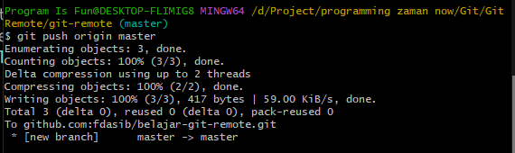

# Push

---

## Push

- Walaupun kita sudah menyimpan perubahan di Git Project di local, tapi tidak secara otomatis akan di sync dengan Remote Repository
- Hal ini karena sejak awal Git di desain sebagai distributed version control, artinya kita bisa melakukan perubahan dimanapun dan kapanpun, tanpa harus terkoneksi ke Git Server
- Oleh karena itu, jika kita ingin mengirim perubahan yang terjadi di Git Project di local kita, kita perlu mengirimnya secara manual ke Git Server
- Untuk mengirim perubahan di local ke git server, kita bisa gunakan perintah yang bernama push

---

## Push Branch

- Untuk mengirim perubahan branch ke remote repository dengan nama branch sama:
```
git push namaremote localbranch
```
- Untuk mengirim perubahan branch ke remote repository dengan nama branch yang berbeda, kita bisa gunakan perintah :
```
git push namaremote localbranch:remotebranch
```



---

## Push Semua Branch

- Jika kita ingin mengirim semua perubahan di semua branch ke remote repository, kita bisa gunakan perintah :
```
git push origin --all
```

---

## Menghapus Branch

- Perintah Push juga bisa digunakan untuk menghapus branch yang ada di remote repository
- Kita bisa gunakan perintah
```
git push --delete namaremote namabranch
```
- Perlu diingat, menghapus remote branch bukan berarti menghapus branch di local, jadi jika kita ingin hapus di local, kita harus lakukan secara manual