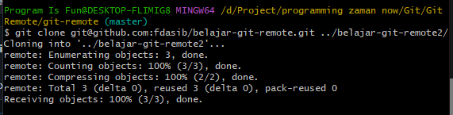

# Clone

---

## Clone

- Apa yang harus dilakukan jika misal kita ingin download project Git yang ada di Server ke komputer baru?
- Hal ini dinamakan perintah clone
- Dengan perintah clone, kita bisa download project di remote repository ke local dan secara otomatis di download sebagai git project

---

## Melakukan Clone

- Untuk melakukan clone, kita bisa gunakan perintah :
```
git clone urlremoterepository
```
- Secara default, clone akan membuat project dengan nama folder sama dengan nama project remote repository
- Jika kita ingin melakukan clone, dengan nama folder yang berbeda dengan nama project remote repository, kita bisa gunakan perintah :
```
git clone urlremoterepository namafolder
```



---

## Default Hasil Clone

- Default clone akan berisi remote repository origin ke git remote repository yang kita clone
- Default clone akan berisikan branch utama di remote repository

---

## Tugas

- Simulasikan terdapat dua pengguna
- Clone project Git di remote di folder yang berbeda